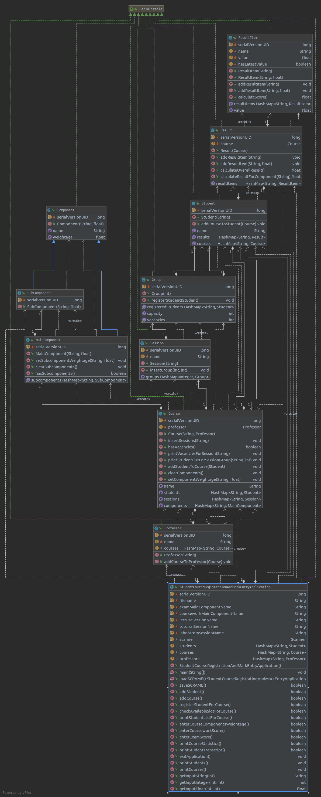

# SCRAME

CZ2002 Project - Student Course Registration And Mark Entry Application (SCRAME)

---

## Overview
SCRAME is designed for **course administrators** at education institutions. SCRAME facilitates student and course registration, mark entry, transcript generation and course analysis. SCRAME is portable - its data can be saved and loaded into other SCRAME applications.

The full set of features are shown below:
```
|----------------------------------------------------------|
| Student Course Registration And Mark Entry (SCRAME) Menu |
|----------------------------------------------------------|
| Please select a command below                            |
| 1. Add a student                                         |
| 2. Add a course                                          |
| 3. Register student for course                           |
| 4. Check available slots for class                       |
| 5. Print student list                                    |
| 6. Enter course assessment components weightage          |
| 7. Enter coursework score                                |
| 8. Enter exam score                                      |
| 9. Print course statistics                               |
| 10. Print student transcript                             |
|----------------------------------------------------------|
|                                   | (0) Save | (-1) Exit |
|----------------------------------------------------------|
```

## Javadoc
The Javadoc can be found [here](https://quizzical-fermi-b55f0c.netlify.com).

### UML Class Diagram


